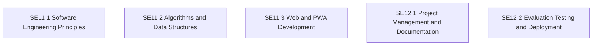

# Software-Engineering-Examinable-Terms-for-the-NSW-HSC
This is an unofficial guidance map showing all examinable terms for the NSW Stage 6 Software Engineering examination.

```mermaid
graph TD
O1[SE11 1 Software Engineering Principles]
O2[SE11 2 Algorithms and Data Structures]
O3[SE11 3 Web and PWA Development]
O4[SE12 1 Project Management and Documentation]
O5[SE12 2 Evaluation Testing and Deployment]
```
