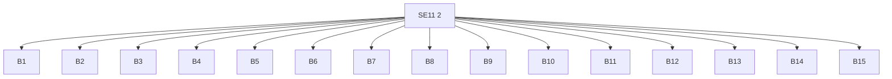
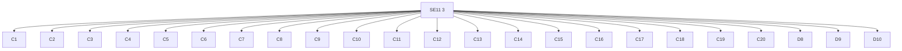
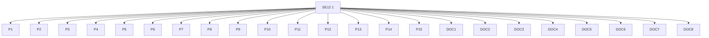
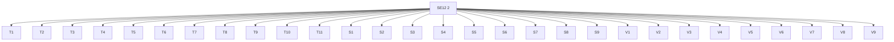

# Software-Engineering-Examinable-Terms-for-the-NSW-HSC
This is an unofficial guidance map showing all examinable terms for the NSW Stage 6 Software Engineering examination.

---

## 1. Outcomes

---
## 2. Principles

---

## 3. Algorithms & Data Structures

---

## 4. Web & PWA Development

---

## 5. Data & Storage

---

## 6. Security

---

## 7. Project Management

---

## 8. Documentation

---

## 9. Testing & Deployment

---

## 10. NESA Glossary Verbs

---

## 11. Links to Outcomes (broken into readable chunks)

### O1 → Principles

### O2 → Algorithms

---

### O3 → Web/PWA + Storage

---

### O4 → Project Management + Documentation

### O5 → Testing + Security + Verbs

---

