# Concept Map

```mermaid
graph TD

O1[SE11‑1 Principles]
O2[SE11‑2 Algorithms]
O3[SE11‑3 Web & PWA]
O4[SE12‑1 PM & Docs]
O5[SE12‑2 Testing & Security]

click O1 "https://github.com/detnsw-sydtech/Software-Engineering-Examinable-Terms-for-the-NSW-HSC/blob/main/maps/principles-map.md"
click O2 "https://github.com/detnsw-sydtech/Software-Engineering-Examinable-Terms-for-the-NSW-HSC/blob/main/maps/algorithms-map.md"
click O3 "https://github.com/detnsw-sydtech/Software-Engineering-Examinable-Terms-for-the-NSW-HSC/blob/main/maps/web-map.md"
click O4 "https://github.com/detnsw-sydtech/Software-Engineering-Examinable-Terms-for-the-NSW-HSC/blob/main/maps/pm-docs-map.md"
click O5 "https://github.com/detnsw-sydtech/Software-Engineering-Examinable-Terms-for-the-NSW-HSC/blob/main/maps/testing-security-map.md"

```

# 📘 Welcome to the Software Engineering Concept Map

This handbook is your interactive guide to every examinable idea in the NSW Stage 6 Software Engineering syllabus.

Instead of reading a long glossary from top to bottom, you can explore the course the way real software engineers think — by following connections between concepts.

The map is designed to help you:

- see how ideas fit together
- revise efficiently
- jump straight to clear explanations
- prepare for exam‑style questions
- build a deep, connected understanding of the subject

# 🧭 How to Navigate the Concept Map

## 1. Start with the five big outcomes

The first page you’ll see is the Concept Map, which shows the five major outcomes of the 12SE syllabus:

SE11‑1 — Principles

SE11‑2 — Algorithms & Data Structures

SE11‑3 — Web & PWA Development

SE12‑1 — Project Management & Documentation

SE12‑2 — Testing, Security & Deployment

Each outcome box is clickable.
Click one to open a sub‑map for that topic.

2. Each sub‑map shows all the examinable terms
Every sub‑map contains a list of terms arranged in a simple, readable chain.
Each term is also clickable — selecting it takes you to a dedicated explanation page.

For example:

Clicking “Abstraction” opens
terms/principles/abstraction.md

Clicking “Sorting Algorithms” opens
terms/algorithms/sorting-algorithms.md

Clicking “Service Worker” opens
terms/web-pwa/service-worker.md

This makes it easy to revise one idea at a time.

3. Every term page explains the concept clearly
Each term page follows the same structure:

Definition

Why it matters

Where it appears in the syllabus

Examples

Common misconceptions

Exam‑style prompts

Related terms

This gives you a complete, exam‑ready understanding of each idea.

4. Use the “Back to Concept Map” button anytime
Every sub‑map and every term page includes a Back to Concept Map link.

This lets you:

jump back to the big picture

switch topics quickly

revise in whatever order makes sense to you

Think of it like navigating a website — not a textbook.

5. Use the maps to study smarter, not harder
The maps help you:

see relationships (e.g., how Recursion relates to Time Complexity)

revise in clusters (e.g., all security terms together)

prepare for extended responses (which often require linking ideas)

build confidence by exploring at your own pace

This is how professional engineers learn — by understanding the connections.

🎓 Final Tip
If you’re ever unsure where to start, begin with the Concept Map, choose the outcome you’re currently studying, and follow the chain of terms.
Every page is designed to help you build mastery step by step.
