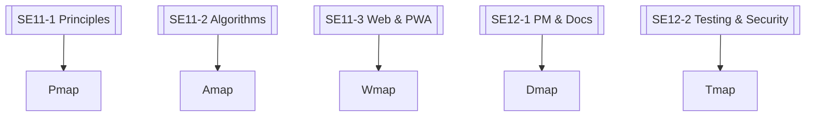

Concept Map

```mermaid
graph TD

O1[[SE11‑1 Principles]] --> Pmap
O2[[SE11‑2 Algorithms]] --> Amap
O3[[SE11‑3 Web & PWA]] --> Wmap
O4[[SE12‑1 PM & Docs]] --> Dmap
O5[[SE12‑2 Testing & Security]] --> Tmap

click O1 "maps/principles-map.md" "View Principles"
click O2 "[maps/algorithms-map.md](https://github.com/detnsw-sydtech/Software-Engineering-Examinable-Terms-for-the-NSW-HSC/blob/main/maps/algorithms-map.md)" "View Algorithms"
click O3 "maps/web-map.md" "View Web & PWA"
click O4 "maps/pm-docs-map.md" "View PM & Docs"
click O5 "maps/testing-security-map.md" "View Testing & Security"
```

