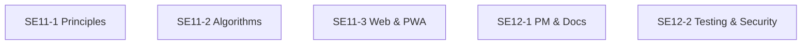

# Concept Map

```mermaid
graph TD

O1[SE11‑1 Principles]
O2[SE11‑2 Algorithms]
O3[SE11‑3 Web & PWA]
O4[SE12‑1 PM & Docs]
O5[SE12‑2 Testing & Security]

click O1 "https://github.com/detnsw-sydtech/Software-Engineering-Examinable-Terms-for-the-NSW-HSC/blob/main/maps/principles-map.md"
click O2 "https://github.com/detnsw-sydtech/Software-Engineering-Examinable-Terms-for-the-NSW-HSC/blob/main/maps/algorithms-map.md"
click O3 "https://github.com/detnsw-sydtech/Software-Engineering-Examinable-Terms-for-the-NSW-HSC/blob/main/maps/web-map.md"
click O4 "https://github.com/detnsw-sydtech/Software-Engineering-Examinable-Terms-for-the-NSW-HSC/blob/main/maps/pm-docs-map.md"
click O5 "https://github.com/detnsw-sydtech/Software-Engineering-Examinable-Terms-for-the-NSW-HSC/blob/main/maps/testing-security-map.md"

```

