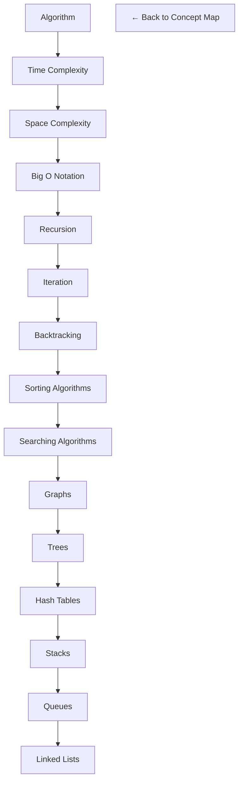

# Algorithms Map

```mermaid
graph TD

%% =========================
%% ALGORITHMS & DATA STRUCTURES MAP
%% =========================

B1[Algorithm]
B2[Time Complexity]
B3[Space Complexity]
B4[Big O Notation]
B5[Recursion]
B6[Iteration]
B7[Backtracking]
B8[Sorting Algorithms]
B9[Searching Algorithms]
B10[Graphs]
B11[Trees]
B12[Hash Tables]
B13[Stacks]
B14[Queues]
B15[Linked Lists]

%% Layout grouping (GitHub-safe)
B1 --> B2
B2 --> B3
B3 --> B4
B4 --> B5
B5 --> B6
B6 --> B7
B7 --> B8
B8 --> B9
B9 --> B10
B10 --> B11
B11 --> B12
B12 --> B13
B13 --> B14
B14 --> B15

%% Clickable links to term pages
click B1 "../terms/algorithms/algorithm.md"
click B2 "../terms/algorithms/time-complexity.md"
click B3 "../terms/algorithms/space-complexity.md"
click B4 "../terms/algorithms/big-o-notation.md"
click B5 "../terms/algorithms/recursion.md"
click B6 "../terms/algorithms/iteration.md"
click B7 "../terms/algorithms/backtracking.md"
click B8 "../terms/algorithms/sorting-algorithms.md"
click B9 "../terms/algorithms/searching-algorithms.md"
click B10 "../terms/algorithms/graphs.md"
click B11 "../terms/algorithms/trees.md"
click B12 "../terms/algorithms/hash-tables.md"
click B13 "../terms/algorithms/stacks.md"
click B14 "../terms/algorithms/queues.md"
click B15 "../terms/algorithms/linked-lists.md"

%% Link back to root map
R[← Back to Concept Map]
click R "../concept-map.md"
```

