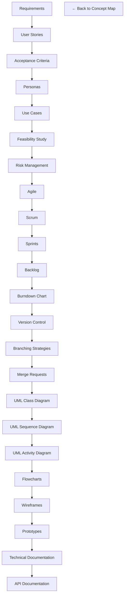

# Project Management Map

```mermaid
graph TD

P1[Requirements]
P2[User Stories]
P3[Acceptance Criteria]
P4[Personas]
P5[Use Cases]
P6[Feasibility Study]
P7[Risk Management]
P8[Agile]
P9[Scrum]
P10[Sprints]
P11[Backlog]
P12[Burndown Chart]
P13[Version Control]
P14[Branching Strategies]
P15[Merge Requests]

DOC1[UML Class Diagram]
DOC2[UML Sequence Diagram]
DOC3[UML Activity Diagram]
DOC4[Flowcharts]
DOC5[Wireframes]
DOC6[Prototypes]
DOC7[Technical Documentation]
DOC8[API Documentation]

P1 --> P2
P2 --> P3
P3 --> P4
P4 --> P5
P5 --> P6
P6 --> P7
P7 --> P8
P8 --> P9
P9 --> P10
P10 --> P11
P11 --> P12
P12 --> P13
P13 --> P14
P14 --> P15

P15 --> DOC1
DOC1 --> DOC2
DOC2 --> DOC3
DOC3 --> DOC4
DOC4 --> DOC5
DOC5 --> DOC6
DOC6 --> DOC7
DOC7 --> DOC8

click P1 "../terms/project-management/requirements.md"
click P2 "../terms/project-management/user-stories.md"
click P3 "../terms/project-management/acceptance-criteria.md"
click P4 "../terms/project-management/personas.md"
click P5 "../terms/project-management/use-cases.md"
click P6 "../terms/project-management/feasibility-study.md"
click P7 "../terms/project-management/risk-management.md"
click P8 "../terms/project-management/agile.md"
click P9 "../terms/project-management/scrum.md"
click P10 "../terms/project-management/sprints.md"
click P11 "../terms/project-management/backlog.md"
click P12 "../terms/project-management/burndown-chart.md"
click P13 "../terms/project-management/version-control.md"
click P14 "../terms/project-management/branching-strategies.md"
click P15 "../terms/project-management/merge-requests.md"

click DOC1 "../terms/documentation/uml-class-diagram.md"
click DOC2 "../terms/documentation/uml-sequence-diagram.md"
click DOC3 "../terms/documentation/uml-activity-diagram.md"
click DOC4 "../terms/documentation/flowcharts.md"
click DOC5 "../terms/documentation/wireframes.md"
click DOC6 "../terms/documentation/prototypes.md"
click DOC7 "../terms/documentation/technical-documentation.md"
click DOC8 "../terms/documentation/api-documentation.md"

R[← Back to Concept Map]
click R "https://github.com/detnsw-sydtech/Software-Engineering-Examinable-Terms-for-the-NSW-HSC/blob/main/concept-map.md"

```
