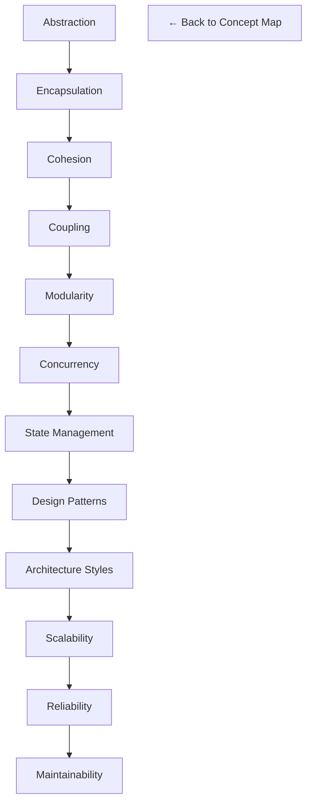

# Principles Map

```mermaid
graph TD

A1[Abstraction]
A2[Encapsulation]
A3[Cohesion]
A4[Coupling]
A5[Modularity]
A6[Concurrency]
A7[State Management]
A8[Design Patterns]
A9[Architecture Styles]
A10[Scalability]
A11[Reliability]
A12[Maintainability]

A1 --> A2
A2 --> A3
A3 --> A4
A4 --> A5
A5 --> A6
A6 --> A7
A7 --> A8
A8 --> A9
A9 --> A10
A10 --> A11
A11 --> A12

click A1 "https://github.com/detnsw-sydtech/Software-Engineering-Examinable-Terms-for-the-NSW-HSC/blob/main/terms/principles/abstraction.md"
click A2 "https://github.com/detnsw-sydtech/Software-Engineering-Examinable-Terms-for-the-NSW-HSC/blob/main/terms/principles/encapsulation.md"
click A3 "https://github.com/detnsw-sydtech/Software-Engineering-Examinable-Terms-for-the-NSW-HSC/blob/main/terms/principles/cohesion.md"
click A4 "https://github.com/detnsw-sydtech/Software-Engineering-Examinable-Terms-for-the-NSW-HSC/blob/main/terms/principles/coupling.md"
click A5 "https://github.com/detnsw-sydtech/Software-Engineering-Examinable-Terms-for-the-NSW-HSC/blob/main/terms/principles/modularity.md"
click A6 "https://github.com/detnsw-sydtech/Software-Engineering-Examinable-Terms-for-the-NSW-HSC/blob/main/terms/principles/concurrency.md"
click A7 "https://github.com/detnsw-sydtech/Software-Engineering-Examinable-Terms-for-the-NSW-HSC/blob/main/terms/principles/state-management.md"
click A8 "https://github.com/detnsw-sydtech/Software-Engineering-Examinable-Terms-for-the-NSW-HSC/blob/main/terms/principles/design-patterns.md"
click A9 "https://github.com/detnsw-sydtech/Software-Engineering-Examinable-Terms-for-the-NSW-HSC/blob/main/terms/principles/architecture-styles.md"
click A10 "https://github.com/detnsw-sydtech/Software-Engineering-Examinable-Terms-for-the-NSW-HSC/blob/main/terms/principles/scalability.md"
click A11 "https://github.com/detnsw-sydtech/Software-Engineering-Examinable-Terms-for-the-NSW-HSC/blob/main/terms/principles/reliability.md"
click A12 "https://github.com/detnsw-sydtech/Software-Engineering-Examinable-Terms-for-the-NSW-HSC/blob/main/terms/principles/maintainability.md"

R[← Back to Concept Map]
click R "https://github.com/detnsw-sydtech/Software-Engineering-Examinable-Terms-for-the-NSW-HSC/blob/main/concept-map.md"

```

