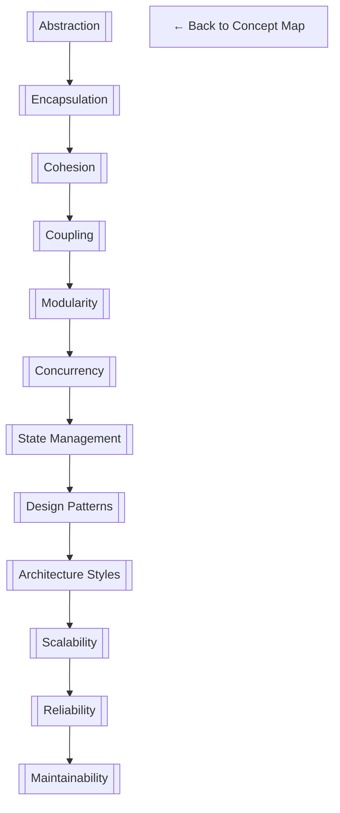

# Principles Map

```mermaid
graph TD

A1[[Abstraction]] --> A2
A2[[Encapsulation]] --> A3
A3[[Cohesion]] --> A4
A4[[Coupling]] --> A5
A5[[Modularity]] --> A6
A6[[Concurrency]] --> A7
A7[[State Management]] --> A8
A8[[Design Patterns]] --> A9
A9[[Architecture Styles]] --> A10
A10[[Scalability]] --> A11
A11[[Reliability]] --> A12
A12[[Maintainability]]

click A1 "../terms/principles/abstraction.md"
click A2 "../terms/principles/encapsulation.md"
click A3 "../terms/principles/cohesion.md"
click A4 "../terms/principles/coupling.md"
click A5 "../terms/principles/modularity.md"
click A6 "../terms/principles/concurrency.md"
click A7 "../terms/principles/state-management.md"
click A8 "../terms/principles/design-patterns.md"
click A9 "../terms/principles/architecture-styles.md"
click A10 "../terms/principles/scalability.md"
click A11 "../terms/principles/reliability.md"
click A12 "../terms/principles/maintainability.md"

R[← Back to Concept Map]
click R "../concept-map.md"
```

