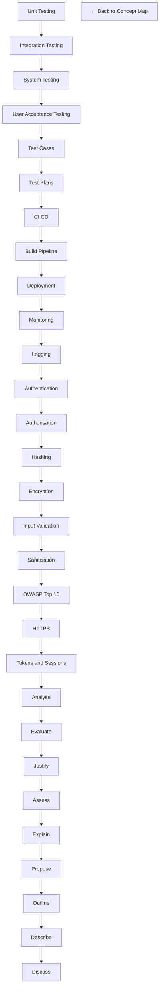

# Testing and Security Map

```mermaid
graph TD

T1[Unit Testing]
T2[Integration Testing]
T3[System Testing]
T4[User Acceptance Testing]
T5[Test Cases]
T6[Test Plans]
T7[CI CD]
T8[Build Pipeline]
T9[Deployment]
T10[Monitoring]
T11[Logging]

S1[Authentication]
S2[Authorisation]
S3[Hashing]
S4[Encryption]
S5[Input Validation]
S6[Sanitisation]
S7[OWASP Top 10]
S8[HTTPS]
S9[Tokens and Sessions]

V1[Analyse]
V2[Evaluate]
V3[Justify]
V4[Assess]
V5[Explain]
V6[Propose]
V7[Outline]
V8[Describe]
V9[Discuss]

T1 --> T2
T2 --> T3
T3 --> T4
T4 --> T5
T5 --> T6
T6 --> T7
T7 --> T8
T8 --> T9
T9 --> T10
T10 --> T11

T11 --> S1
S1 --> S2
S2 --> S3
S3 --> S4
S4 --> S5
S5 --> S6
S6 --> S7
S7 --> S8
S8 --> S9

S9 --> V1
V1 --> V2
V2 --> V3
V3 --> V4
V4 --> V5
V5 --> V6
V6 --> V7
V7 --> V8
V8 --> V9

%% Testing links
click T1 "https://github.com/detnsw-sydtech/Software-Engineering-Examinable-Terms-for-the-NSW-HSC/blob/main/terms/testing-deployment/unit-testing.md"
click T2 "https://github.com/detnsw-sydtech/Software-Engineering-Examinable-Terms-for-the-NSW-HSC/blob/main/terms/testing-deployment/integration-testing.md"
click T3 "https://github.com/detnsw-sydtech/Software-Engineering-Examinable-Terms-for-the-NSW-HSC/blob/main/terms/testing-deployment/system-testing.md"
click T4 "https://github.com/detnsw-sydtech/Software-Engineering-Examinable-Terms-for-the-NSW-HSC/blob/main/terms/testing-deployment/user-acceptance-testing.md"
click T5 "https://github.com/detnsw-sydtech/Software-Engineering-Examinable-Terms-for-the-NSW-HSC/blob/main/terms/testing-deployment/test-cases.md"
click T6 "https://github.com/detnsw-sydtech/Software-Engineering-Examinable-Terms-for-the-NSW-HSC/blob/main/terms/testing-deployment/test-plans.md"
click T7 "https://github.com/detnsw-sydtech/Software-Engineering-Examinable-Terms-for-the-NSW-HSC/blob/main/terms/testing-deployment/ci-cd.md"
click T8 "https://github.com/detnsw-sydtech/Software-Engineering-Examinable-Terms-for-the-NSW-HSC/blob/main/terms/testing-deployment/build-pipeline.md"
click T9 "https://github.com/detnsw-sydtech/Software-Engineering-Examinable-Terms-for-the-NSW-HSC/blob/main/terms/testing-deployment/deployment.md"
click T10 "https://github.com/detnsw-sydtech/Software-Engineering-Examinable-Terms-for-the-NSW-HSC/blob/main/terms/testing-deployment/monitoring.md"
click T11 "https://github.com/detnsw-sydtech/Software-Engineering-Examinable-Terms-for-the-NSW-HSC/blob/main/terms/testing-deployment/logging.md"

%% Security links
click S1 "https://github.com/detnsw-sydtech/Software-Engineering-Examinable-Terms-for-the-NSW-HSC/blob/main/terms/security/authentication.md"
click S2 "https://github.com/detnsw-sydtech/Software-Engineering-Examinable-Terms-for-the-NSW-HSC/blob/main/terms/security/authorisation.md"
click S3 "https://github.com/detnsw-sydtech/Software-Engineering-Examinable-Terms-for-the-NSW-HSC/blob/main/terms/security/hashing.md"
click S4 "https://github.com/detnsw-sydtech/Software-Engineering-Examinable-Terms-for-the-NSW-HSC/blob/main/terms/security/encryption.md"
click S5 "https://github.com/detnsw-sydtech/Software-Engineering-Examinable-Terms-for-the-NSW-HSC/blob/main/terms/security/input-validation.md"
click S6 "https://github.com/detnsw-sydtech/Software-Engineering-Examinable-Terms-for-the-NSW-HSC/blob/main/terms/security/sanitisation.md"
click S7 "https://github.com/detnsw-sydtech/Software-Engineering-Examinable-Terms-for-the-NSW-HSC/blob/main/terms/security/owasp-top-10.md"
click S8 "https://github.com/detnsw-sydtech/Software-Engineering-Examinable-Terms-for-the-NSW-HSC/blob/main/terms/security/https.md"
click S9 "https://github.com/detnsw-sydtech/Software-Engineering-Examinable-Terms-for-the-NSW-HSC/blob/main/terms/security/tokens-sessions.md"

%% Glossary verbs
click V1 "https://github.com/detnsw-sydtech/Software-Engineering-Examinable-Terms-for-the-NSW-HSC/blob/main/terms/glossary-verbs/analyse.md"
click V2 "https://github.com/detnsw-sydtech/Software-Engineering-Examinable-Terms-for-the-NSW-HSC/blob/main/terms/glossary-verbs/evaluate.md"
click V3 "https://github.com/detnsw-sydtech/Software-Engineering-Examinable-Terms-for-the-NSW-HSC/blob/main/terms/glossary-verbs/justify.md"
click V4 "https://github.com/detnsw-sydtech/Software-Engineering-Examinable-Terms-for-the-NSW-HSC/blob/main/terms/glossary-verbs/assess.md"
click V5 "https://github.com/detnsw-sydtech/Software-Engineering-Examinable-Terms-for-the-NSW-HSC/blob/main/terms/glossary-verbs/explain.md"
click V6 "https://github.com/detnsw-sydtech/Software-Engineering-Examinable-Terms-for-the-NSW-HSC/blob/main/terms/glossary-verbs/propose.md"
click V7 "https://github.com/detnsw-sydtech/Software-Engineering-Examinable-Terms-for-the-NSW-HSC/blob/main/terms/glossary-verbs/outline.md"
click V8 "https://github.com/detnsw-sydtech/Software-Engineering-Examinable-Terms-for-the-NSW-HSC/blob/main/terms/glossary-verbs/describe.md"
click V9 "https://github.com/detnsw-sydtech/Software-Engineering-Examinable-Terms-for-the-NSW-HSC/blob/main/terms/glossary-verbs/discuss.md"

R[← Back to Concept Map]
click R "https://github.com/detnsw-sydtech/Software-Engineering-Examinable-Terms-for-the-NSW-HSC/blob/main/concept-map.md"

```
