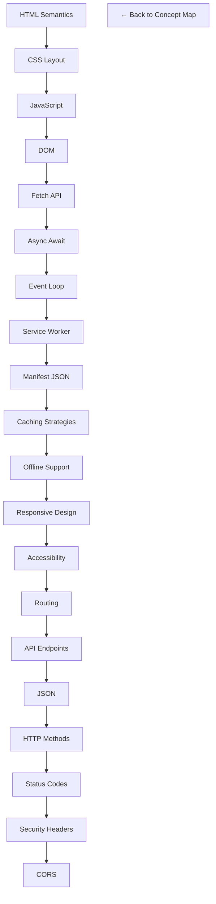

# Wep Map

```mermaid
graph TD

C1[HTML Semantics]
C2[CSS Layout]
C3[JavaScript]
C4[DOM]
C5[Fetch API]
C6[Async Await]
C7[Event Loop]
C8[Service Worker]
C9[Manifest JSON]
C10[Caching Strategies]
C11[Offline Support]
C12[Responsive Design]
C13[Accessibility]
C14[Routing]
C15[API Endpoints]
C16[JSON]
C17[HTTP Methods]
C18[Status Codes]
C19[Security Headers]
C20[CORS]

C1 --> C2
C2 --> C3
C3 --> C4
C4 --> C5
C5 --> C6
C6 --> C7
C7 --> C8
C8 --> C9
C9 --> C10
C10 --> C11
C11 --> C12
C12 --> C13
C13 --> C14
C14 --> C15
C15 --> C16
C16 --> C17
C17 --> C18
C18 --> C19
C19 --> C20

click C1 "../terms/web-pwa/html-semantics.md"
click C2 "../terms/web-pwa/css-layout.md"
click C3 "../terms/web-pwa/javascript.md"
click C4 "../terms/web-pwa/dom.md"
click C5 "../terms/web-pwa/fetch-api.md"
click C6 "../terms/web-pwa/async-await.md"
click C7 "../terms/web-pwa/event-loop.md"
click C8 "../terms/web-pwa/service-worker.md"
click C9 "../terms/web-pwa/manifest-json.md"
click C10 "../terms/web-pwa/caching-strategies.md"
click C11 "../terms/web-pwa/offline-support.md"
click C12 "../terms/web-pwa/responsive-design.md"
click C13 "../terms/web-pwa/accessibility.md"
click C14 "../terms/web-pwa/routing.md"
click C15 "../terms/web-pwa/api-endpoints.md"
click C16 "../terms/web-pwa/json.md"
click C17 "../terms/web-pwa/http-methods.md"
click C18 "../terms/web-pwa/status-codes.md"
click C19 "../terms/web-pwa/security-headers.md"
click C20 "../terms/web-pwa/cors.md"

R[← Back to Concept Map]
click R "../concept-map.md"
```
